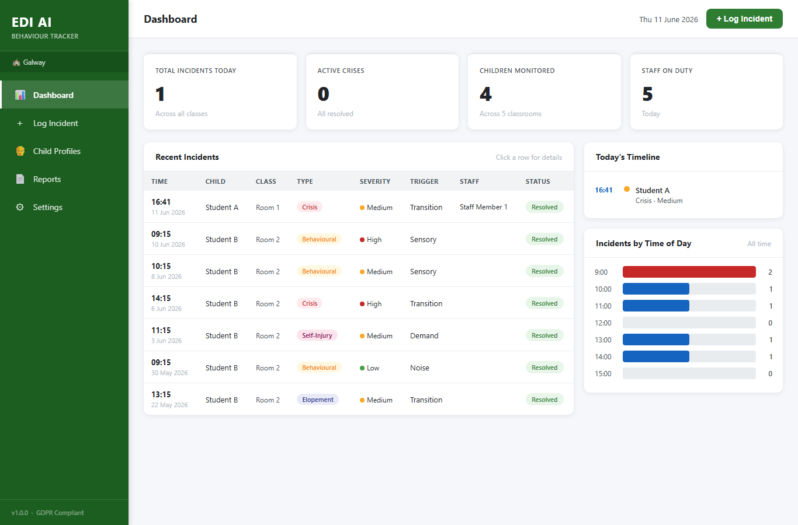

# EDI AI — Behaviour Tracker

AI-powered behaviour incident tracking for special needs schools.

Built in Ireland, for Irish schools.

## Download

**[⬇ Download the latest Windows app (.exe)](https://github.com/MariusNeculau/ediai-behaviour-tracker/releases/latest/download/EDIAIBehaviourTracker.exe)**

No Python needed — double-click the `.exe` and the app opens in your browser at
<http://127.0.0.1:5000/>. Your data is saved in an `instance\behaviour.db` file next to the
executable, so keep it in its own folder. (Unsigned build: if Windows SmartScreen warns, choose
*More info → Run anyway*.) All other releases are on the
[releases page](https://github.com/MariusNeculau/ediai-behaviour-tracker/releases).

## Features
- Real-time behaviour incident logging
- Crisis tracking with triggers and interventions
- Automatic pattern analysis
- One-click progress reports
- Multi-classroom dashboard
- GDPR compliant — all data stays on school premises

## Contact
Marius Neculau — AI Engineer — Galway, Ireland
mariusneculau@gmail.com
